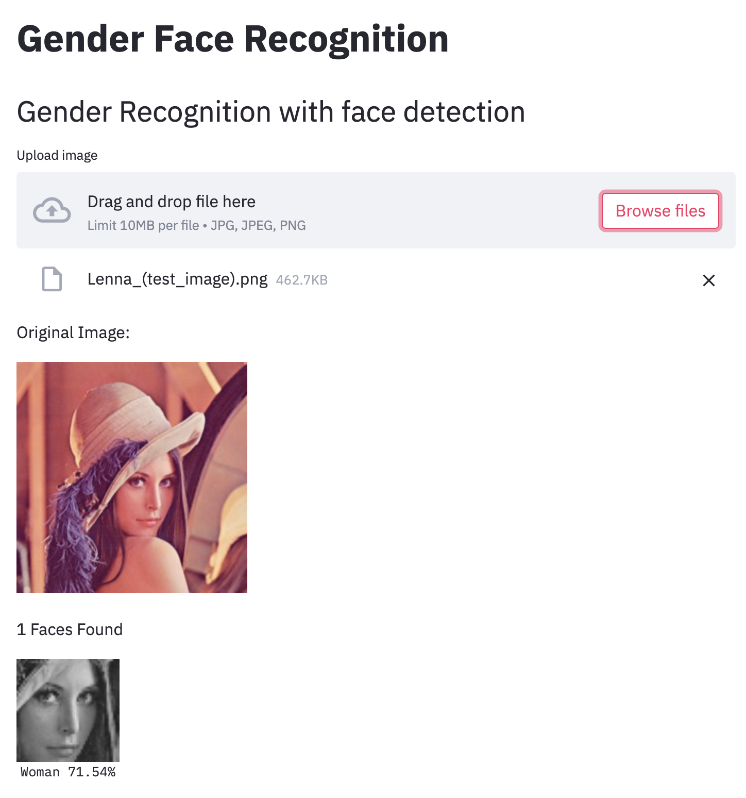
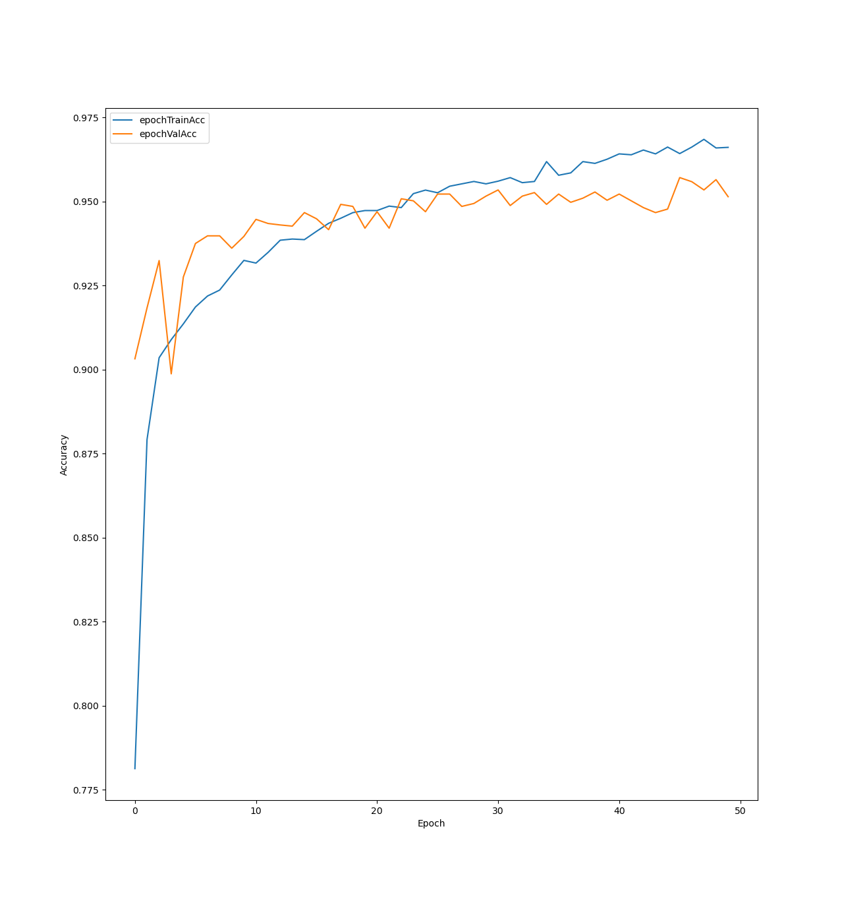
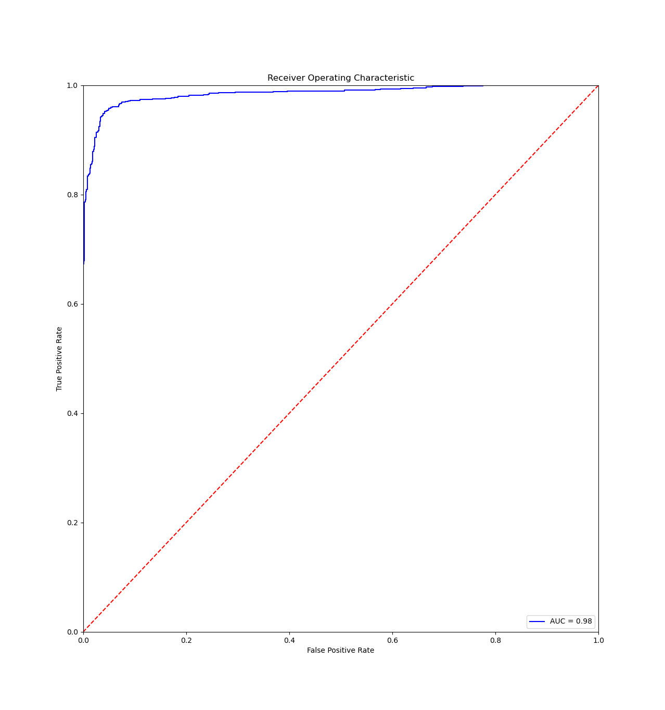
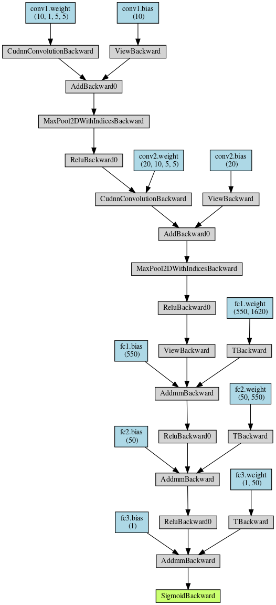

# Gender Face recognition (DNN)
This repo contains jupyter notebook (training convolutional dnn) and python files to deploy model with streamlit and Docker.

Test url : gfcr.c0d.ru



## Task

| Parameter     | Value         |
| ------------- |:-------------:|
| Type | Binary Classification |
| Input | Face Image 48 x 48 |
| Metric | Accuracy |

## Dataset
https://www.kaggle.com/nipunarora8/age-gender-and-ethnicity-face-data-csv

| Parameter     | Value         |
| ------------- |:-------------:|
| Number of Images | 23.7k |
| Image Size | 48 x 48 |
| Test/train/val split |  20/70/10 |

## Production Pipeline
The project's pipeline could be described in a such way:

Streamlit -> OpenCV (Face detection) -> Pytorch (DNN) -> Streamlit

### OpenCV Face detection
To detect and crop faces on image cv2.CascadeClassifier was used. Configure file was choosen "haarcascade_frontalface_default" (src.model.FaceRecognitionPipeline).

### Pytorch DNN
After cv2.CascadeClassifier image was passed to CNN with sigmoid function as output.






## Results
| Parameter     | Value         |
| ------------- |:-------------:|
| Model | gfcr_v4.pt |
| Train | 0.966 |
| Val | 0.951 |
| Test | 0.944 |  

## Technologies

Used packages:
1. PyTorch
2. OpenCV
3. Pandas
4. Streamlit
5. Docker

## Usage Docker
```shell
bash docker/docker_build.sh
bash docker/docker_run.sh
```